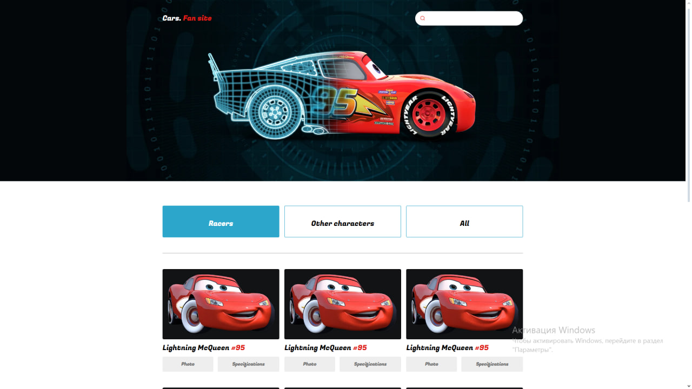

# Cars-Fun-Site

The project is a fully adaptive catalog site focused on demonstrating various vehicles from the Cars universe. Deploy you can check [here](https://frontgr.github.io/Cars-Fun-Site/).

## Preview of the project

Link to Figma layout is [here](https://www.figma.com/file/ol0x9Z5dX0ieiRWCvPva4T/Cars.-Fun-Site?type=design&node-id=1%3A1000&mode=design&t=7tHvCBJEXAwLnWIi-1).

---

### Technologies Used

1. BEM notation
2. SCSS
3. Docker
4. Vanilia JS

Car-Fun-Site contains information about cars and their images.

---

### Formatting rules

We use Prettier for formatting our text. See more about our configuration [here](https://frontgr.github.io/docs/prettierrc/prettierrc/).

---

### How to run Docker

You should clone the repository, install Docker and run this command in the same directory:

    
    docker-compose up --build
    

You can read more about Docker [here](https://frontgr.github.io/docs/docker/docker/).

---

Project has [MIT License](https://github.com/frontgr/Cars-Fun-Site/blob/main/LICENSE).

